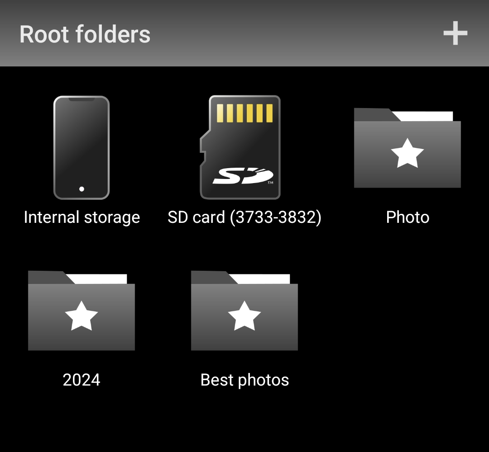
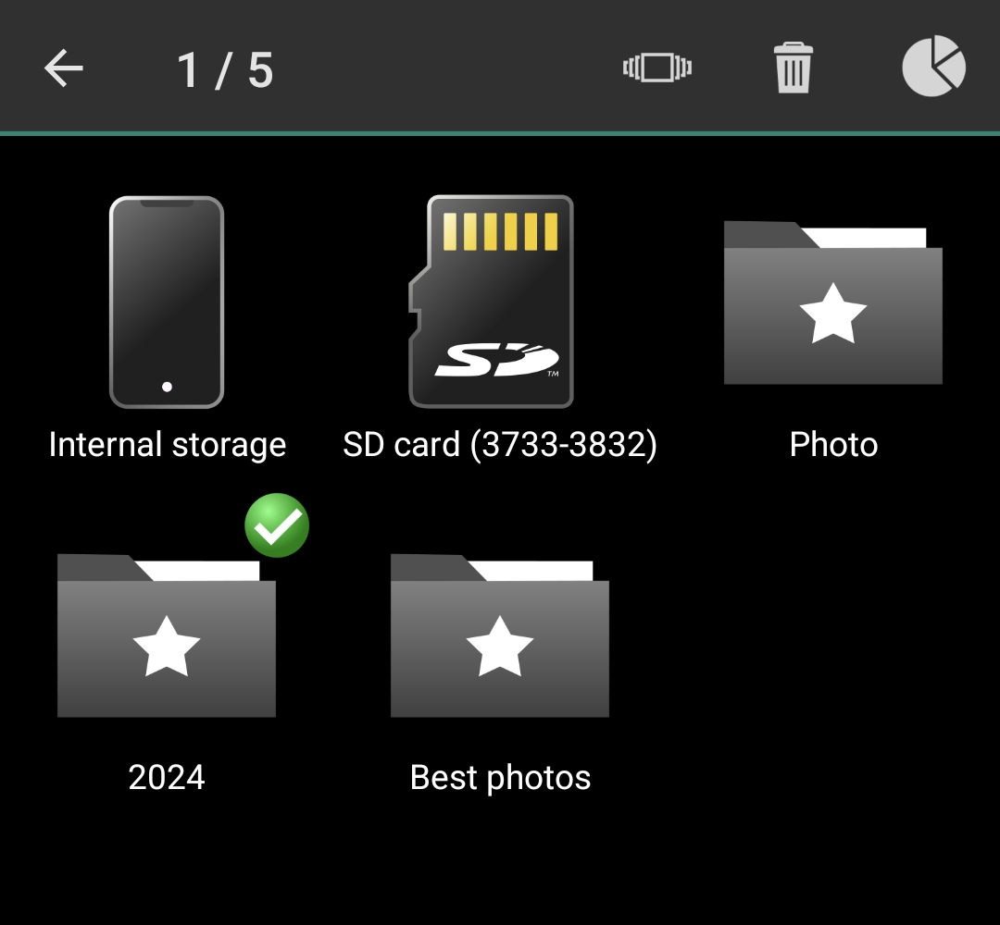
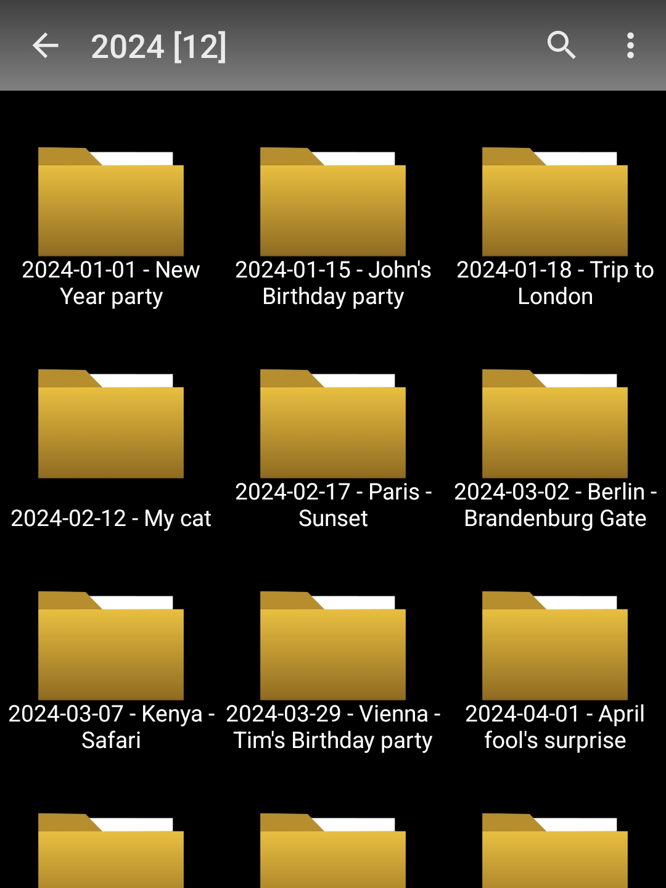
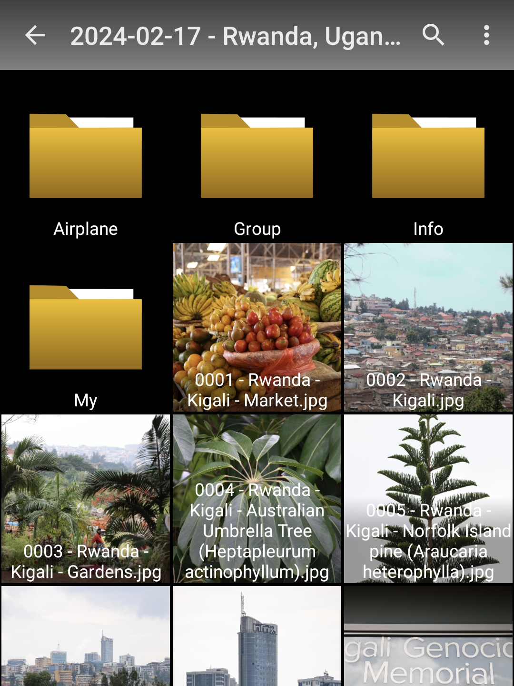
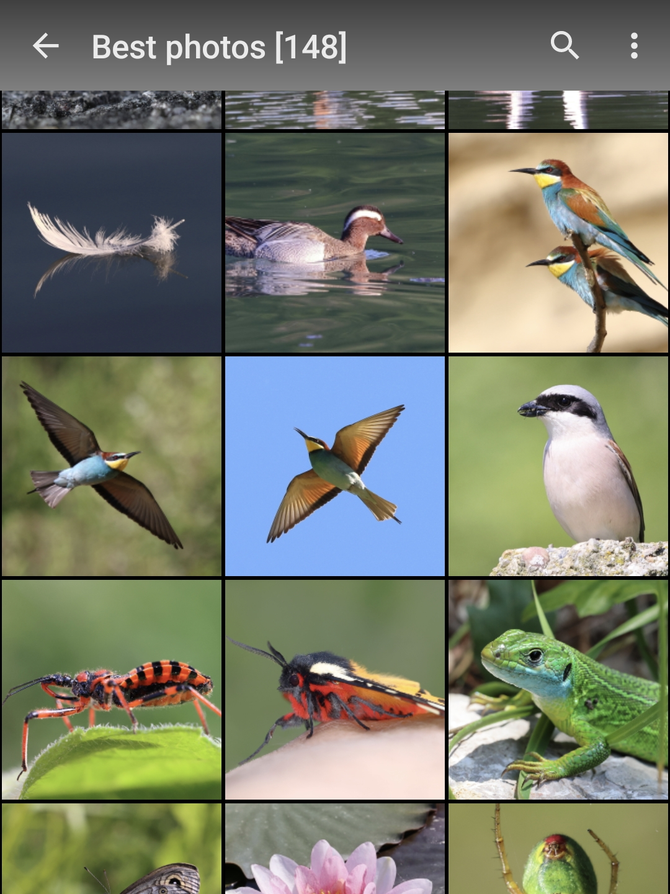
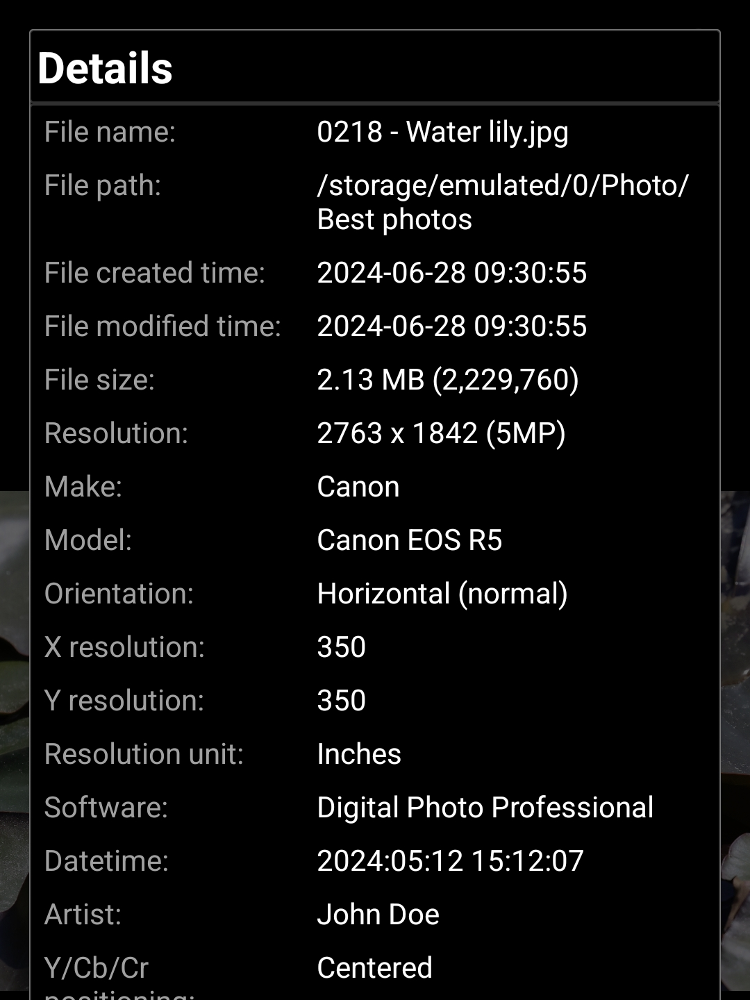
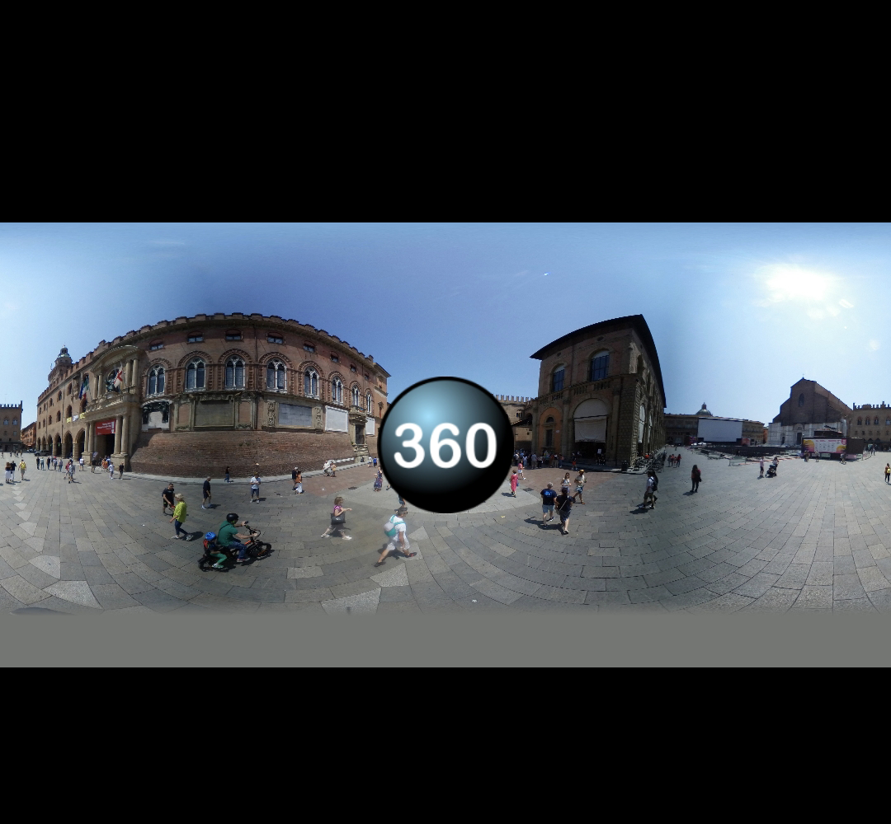
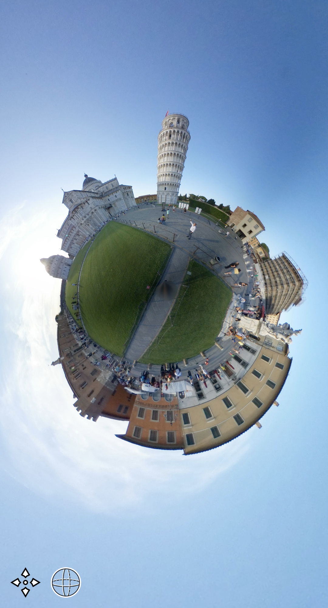
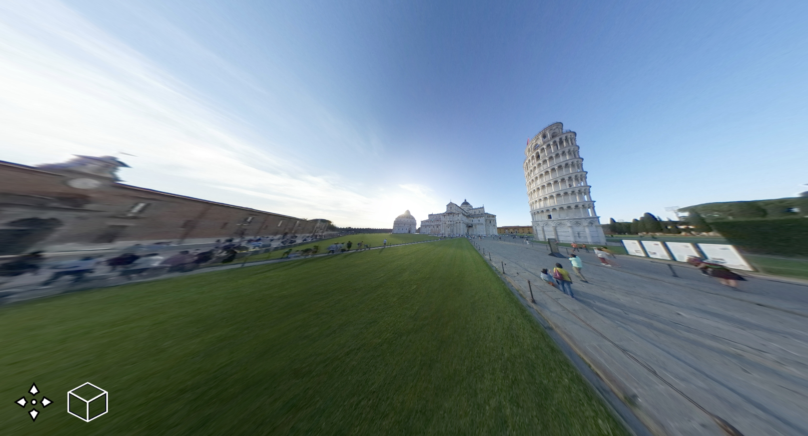
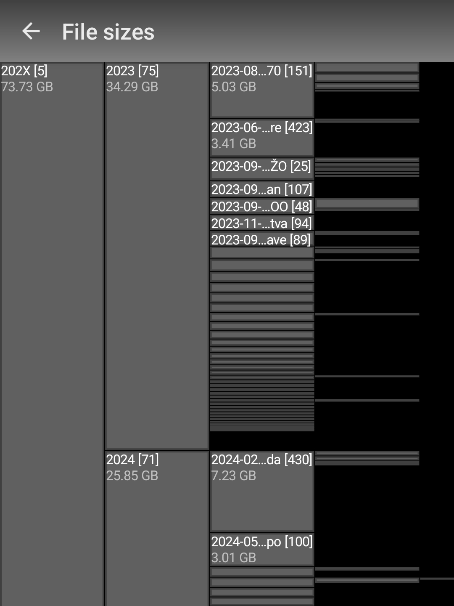

# Media Browser for Android

## 1. Description

Media Browser allows listing and viewing images and videos through directories (folders) on the
internal and external storages on Android phones. Unlike the default stock or most 3rd party photo 
gallery applications, which display all the images as a flat list, sorted by date, Media Browser
allows the user to select a specific directory, and display only its images. It also allows sorting 
by the file name, which is lacking in most of the other gallery applications.

Media Browser displays full EXIF data of JPEG images, and contains a files sizes viewer.

Media Browser includes a 360-degree panoramic viewer, with a rectilinear or spherical mode.

Media Browser does not contain ads and is and will always be completely free.

Pre-built APK is available here:
- <a href="https://github.com/sergenious/MediaBrowserAndroid/releases/download/v1.0/MediaBrowser-1.0.apk">MediaBrowser-1.0.apk</a>

## 2. Directory listing

Media Browser list all the storages, and allows adding or removing the shortcuts to the frequently
used directories.

Long pressing on any item opens a selection mode, where a slideshow from all the selected 
directories can be started. It also allows displaying the hierarchical sizes of all the files in the 
selected directory.

When selecting a storage or a shortcut, a directory listing is displayed.

Sub-directories and images are displayed together. There is a menu option to show or hide file 
names (labels) over the files. 

Title bar displays the name of the directory, together with the number of the items (files and
sub-directories) in the selected directory.

There is a menu option to start a slideshow of all the files, including the recursive 
sub-directories.

An option for a recursive search by file is included.

## 3. Media viewing

Media files are swipeable to the previous and the next file (if existing). Images can be zoomed
by 2-finger gestures.

Full EXIF information is displayed with the JPEG file details.

When displaying panoramic images (360-degree or less), a marker is displayed over the image, 
indicating the panoramic viewer option.

Panoramic viewer in a spheric mode, when fully zoomed-out, displays a "tiny-planet". 

Panoramic viewer in a rectilinear mode.

## 4. File sizes

Similar to the "Disk usage" application, Media Browser can display the cumulative directory and file
sizes of the selected directory, making finding big files easier.

## 5. Localization

Media Browser is available in the following languages:

- [English](app/src/main/res/values/strings.xml)
- [Slovenian](app/src/main/res/values-sl/strings.xml)

You are welcome to provide translations for the other languages as well. 
